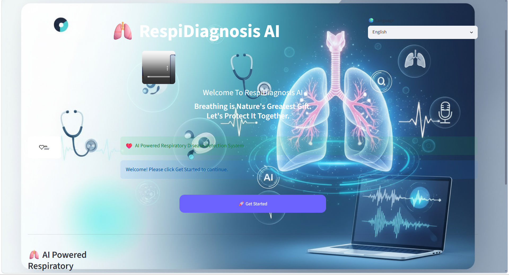
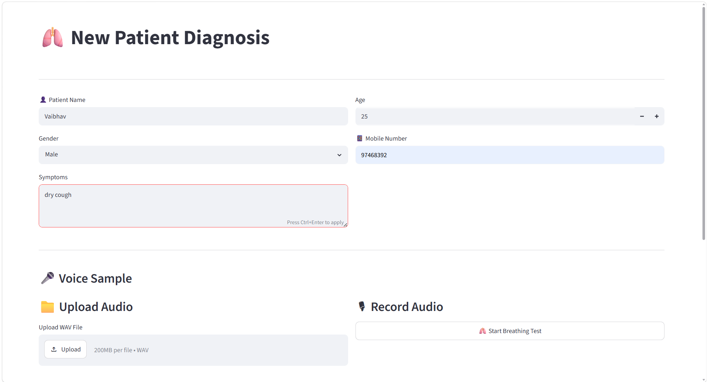
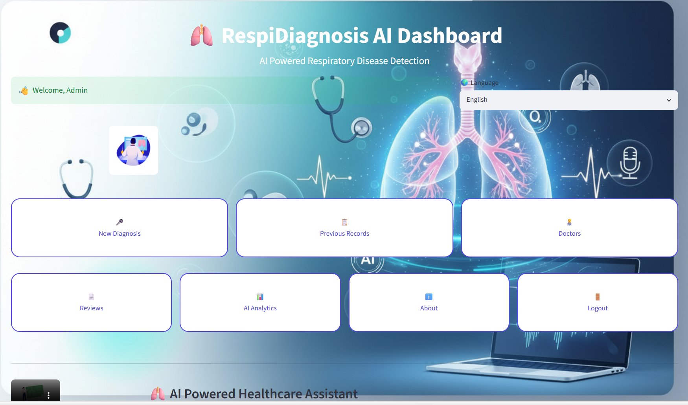
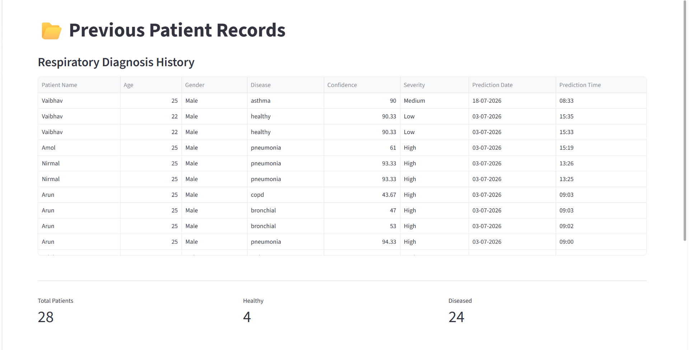
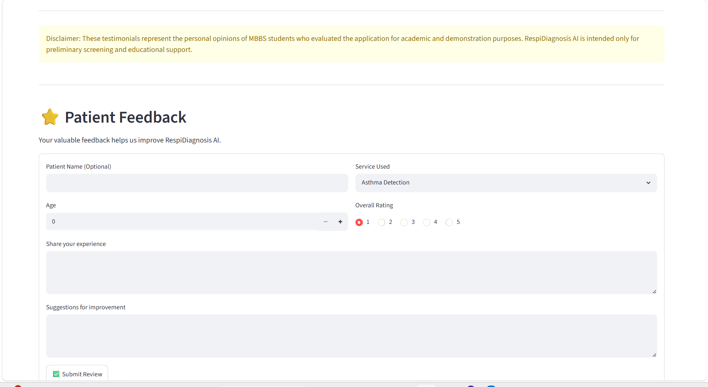

# 🫁 RESPIDiagnosisProject
### Voice-Based Respiratory Disease Diagnosis using Machine Learning

---

# 📖 Project Overview

RESPIDiagnosisProject is an AI-powered healthcare application that predicts respiratory diseases using a patient's voice recording.

The system extracts audio features from cough or breathing recordings, processes them using Machine Learning, and predicts respiratory diseases with an interactive Streamlit web application.

This project demonstrates the practical application of Artificial Intelligence in healthcare by providing quick, non-invasive respiratory disease screening.

---

# 🎯 Objectives

- Predict respiratory diseases using voice recordings.
- Assist healthcare professionals in preliminary diagnosis.
- Reduce diagnosis time.
- Provide an easy-to-use web interface.
- Generate patient reports.
- Store patient records.

---

# 🩺 Diseases Predicted

- ✅ Asthma
- ✅ Bronchial Disease
- ✅ COPD
- ✅ Pneumonia
- ✅ Healthy

---

# 🚀 Features

- 🎤 Voice Recording Upload
- 🤖 AI Disease Prediction
- 📊 Machine Learning Model
- 📄 PDF Report Generation
- 👨‍⚕️ Patient Management
- 📁 Previous Records
- ⭐ Patient Reviews
- 👩‍💼 Staff Information
- 📈 Prediction Confidence
- 🖥️ Beautiful Streamlit Dashboard

---

# 🛠️ Technologies Used

| Technology | Purpose |
|------------|---------|
| Python | Backend Development |
| Streamlit | Web Application |
| Random Forest | Machine Learning |
| Librosa | Audio Feature Extraction |
| NumPy | Numerical Computation |
| Pandas | Data Processing |
| Scikit-learn | Machine Learning |
| SQLite | Database |
| ReportLab | PDF Report Generation |
| Matplotlib | Waveform Visualization |

---

# 🧠 Machine Learning Workflow

```
Voice Recording
        │
        ▼
Audio Preprocessing
        │
        ▼
Feature Extraction (Librosa)
        │
        ▼
Feature Vector
        │
        ▼
Random Forest Model
        │
        ▼
Disease Prediction
        │
        ▼
Confidence Score
        │
        ▼
Generate Report
```

---

# 📂 Project Structure

```
RESPIDiagnosisProject
│
├── app.py
├── database.py
├── prediction.py
├── pdf_generator.py
├── requirements.txt
│
├── model/
│      model.pkl
│
├── dataset/
│      asthma/
│      bronchial/
│      copd/
│      healthy/
│      pneumonia/
│
├── database/
│      diagnosis.db
│
├── pages/
│      dashboard.py
│      about.py
│      review.py
│      staff.py
│      records.py
│
├── images/
├── audio/
├── recordings/
├── reports/
└── utils/
```

---

# ⚙️ Installation

## Clone Repository

```bash
git clone https://github.com/anushkamehta049-sketch/RESPIDiagnosisProject.git
```

Move inside project

```bash
cd RESPIDiagnosisProject
```

Install dependencies

```bash
pip install -r requirements.txt
```

Run Project

```bash
streamlit run app.py
```

---

# 💻 Application Screenshots

## Home Page




---

## Prediction Page



---

## Dashboard



---

## Patient Records



---

## Review Page



---

# 🎥 Project Demonstration

👉 **Watch Complete Project Demo**

**▶️ [Click Here to Watch Demo](https://raw.githubusercontent.com/anushkamehta049-sketch/RESPIDiagnosisProject/main/respicare-ai-personal-microsoft-edge-2026-07-18-19-33-44_dd8dUkyu.mp4)**

---

# 📊 Machine Learning Model

Algorithm Used:

- Random Forest Classifier

Why Random Forest?

- High Accuracy
- Handles Multiple Features
- Reduces Overfitting
- Works well for Healthcare Classification Problems
- Fast Prediction

---

# 🎼 Audio Feature Extraction

The project extracts multiple audio features using Librosa:

- MFCC
- Chroma Features
- Mel Spectrogram
- Spectral Centroid
- Zero Crossing Rate
- Spectral Roll-off

These features are combined into a feature vector for disease prediction.

---

# 📄 Report Generation

The application automatically generates a PDF report containing:

- Patient Name
- Age
- Gender
- Disease Prediction
- Confidence Score
- Date
- Voice Waveform

---

# 🗃️ Database

SQLite Database stores:

- Patient Details
- Prediction Results
- Visit History
- Reports
- Reviews

---

# 📈 Future Enhancements

- Deep Learning (CNN + LSTM)
- Real-time Voice Detection
- Doctor Login
- Cloud Database
- Multi-language Support
- Appointment Booking
- Email Report Sharing
- Mobile Application
- AI Chatbot

---

# 🧪 Dataset

Dataset contains voice recordings for:

- Asthma
- COPD
- Bronchial
- Pneumonia
- Healthy

Each recording is preprocessed before training.

---

# 👩‍💻 Developed By

**Anushka Mehta**

Computer Engineering Student

Passionate about

- Artificial Intelligence
- Machine Learning
- Data Science
- Healthcare AI

GitHub

https://github.com/anushkamehta049-sketch

---

# ⭐ If you found this project useful

Please consider giving it a ⭐ on GitHub.

It motivates me to build more AI projects.

---

# 📜 License

This project is licensed under the MIT License.

---

## ❤️ Thank You
